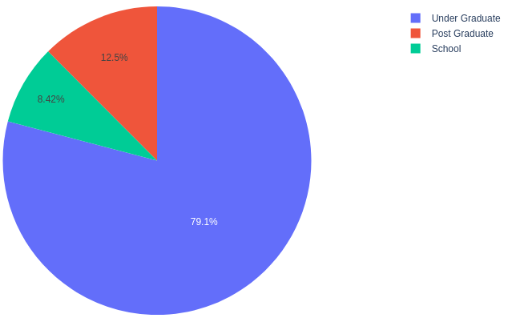
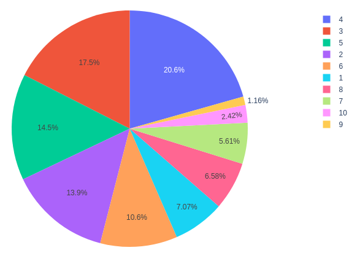
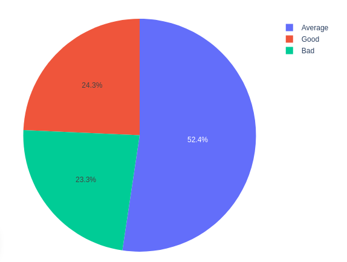
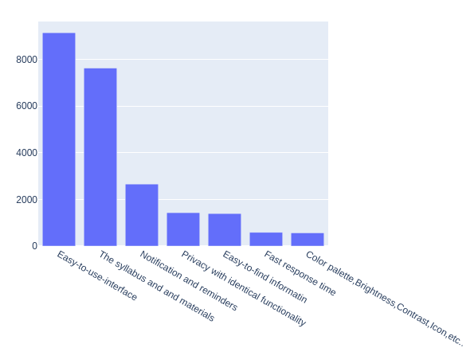
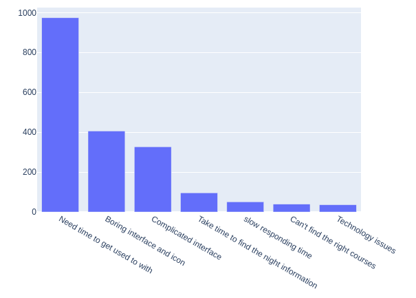

# A Study of student satisfaction in e learning platform

## Description

This project aims to improve the user interface and user experience (UI/UX) of an e-learning platform from the perspective of students. The research focuses on identifying areas for improvement in the platform's navigation, organization of content, and accessibility of resources. Data was collected through a survey administered to students using a sample dataset from Kaggle. The results of the survey were analyzed using statistical analysis techniques to gain insights and make recommendations for enhancing the UI/UX of the platform.

## Table of Contents

- [Installation](#installation)
- [Usage](#usage)
- [Results](#results)
- [Contributing](#contributing)
- [License](#license)

## Installation

1. Clone the repository: `git clone https://github.com/RahmanBhuiyan/E_learning_platfrom_review_analysis.git`
2. Navigate to the project directory: `cd project`
3. Install the required dependencies: `npm install`

## Usage

1. Open the project in your preferred code editor.
2. Configure the necessary settings in the configuration file.
3. Run the project: `npm start`

## Demo

Question 1: Level of education?

The graph shows that not all participants come from a similar instructional stage. For that reason, the study questions are divided into three components based on which levels they may be attending. 

The relevant info in Body 4.1 shows the typical spending time pupils are on the internet studying programs. the pub pie chart in Physique shows the velocity of focus on students from 1033 followers. Around 91.6% of surveyed people were highly curious to work with various the educational system for their purpose

Question 2: How much time do you typically spend on the platform?

Overall, 212 students invest more than 4 hours in online studies at the learning platform from 3 hours invested in online education the rate follows 17.5%, and 1.5% invest 5 hours in the online learning platform

Question 3: Your level of satisfaction with online education?

The following questions were focused on 1033 students in the e-learning platform. Question 3 shows the strengths of the current e-learning platform. The statistic illustrates that Onley the e-learning platform is fulfilled. Most of the answer mentions that e-learning is Onley's remarkable factor.

Question 5: What Features are important on the learning platform?

The bar chart shows the number of important features in the online learning platform from 1033 students. Most surveyed students consider that simple and easy-to-use interfaces are necessary. It is clear from the chart that a good interface plays a key role in the student experience.

Question 6: what frustrates students when using online study and seeking information?

According to the survey result, the most struggling issue of the learning platform is usability (4:6), which is complicated and takes time to be used to with. In terms of visual and information architecture design, the dissatisfaction levels correspond to the value.

## Results

The research findings indicated several areas for improvement in the e-learning platform's UI/UX:

1. Navigation: The majority of surveyed students found the platform's navigation to be confusing and difficult to use. Recommendations include redesigning the navigation system to be more intuitive and user-friendly.

2. Organization of Content: Students felt that the content on the platform was not well organized. It is recommended to restructure and categorize the content in a logical and easily accessible manner.

3. Accessibility of Resources: Students expressed challenges in finding and accessing the necessary resources. Suggestions include implementing a more efficient search functionality and improving the organization of resource materials.

The research provides insights and recommendations that can be utilized by e-learning platform developers to enhance the user experience for students.

## Contributing

Contributions to this project are welcome. If you would like to contribute, please follow these steps:

1. Fork the repository.
2. Create a new branch for your feature: `git checkout -b feature-name`.
3. Implement your changes and commit them: `git commit -m "Add feature description"`.
4. Push your changes to your branch: `git push origin feature-name`.
5. Open a pull request explaining your changes.

## Contact

For any inquiries or questions, please contact [Abdullah Al Rahman](mailto:bhuiyanrahman2002@gmail.com).

